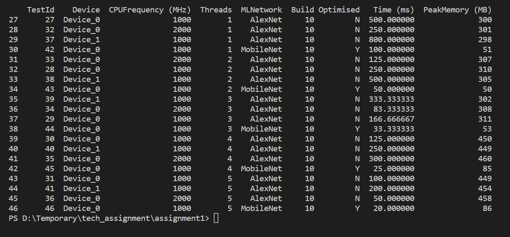
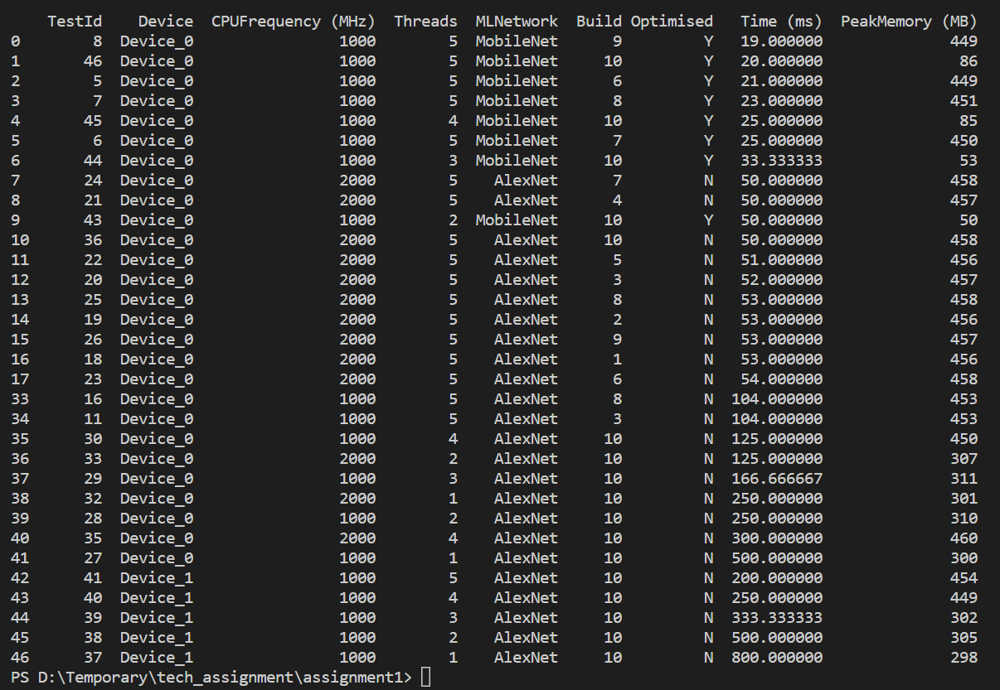
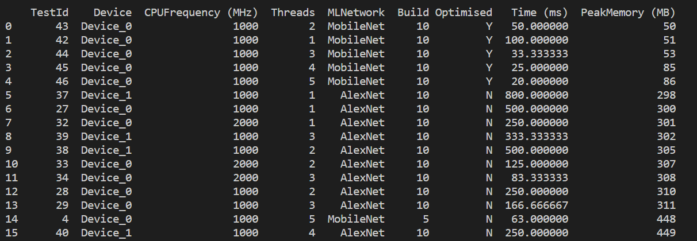

# Performance analysis of Machine Learning loads

#### Parameters

The parameters used for testing and analyzing the performance of Machine Learning(ML) devices are as follows.

```sh
Device              - Different Hardware(Device_0 and Device_1)
CPUFrequency(MHz)   - Frequency of the CPU, measured in Mega Hertz(2000 MHz and 1000 MHz)
Threads             - Number of Threads(1, 2, 3, 4, 5)
MLNetwork           - Networks used(AlexNet, MobileNet)
Build               - Different Softwares(1, 2, 3, 4, 5, 6, 7, 8, 9, 10)
Optimization        - Is Optimised? (Yes - Y, No - N)
Time(ms)            - Compute time/Speed, measured in milli seconds
PeakMemory(MB)      - Memory used, measured in Mega Bytes
```

The performance of Machine learning algorithms is based on factors Speed/Compute time(ms), CPU frequency, Memory used(PeakMemory), etc. So to analyze the performance data of the ML devices, the data is sorted based on different parameters i.e Time(ms), PeakMemory(MB), etc. The observations made from this analysis are as follows.

##### Observation 1:

This observation is done to analyze the performance of ML devices based on hardware(Device_0 and Device_1). The test results of Device_0 and Device_1 having the same configuration are sorted out.



From the above figure, the Test IDs of Device_0 and Device_1 with their respective Time and PeakMemory are tabulated below to compare them. This comparison has been made by having the parameters Build, CPUFrequency, Threads, and MLNetwork constant.

| Test IDs (Device_0, Device_1) | Build | CPU frequency(Mhz) | Threads | MLNetwork | Time(ms), PeakMemory(MHz) of Device_0 | Time(ms), PeakMemory(MHz) of Device_1 |
| ----------------------------- | ----- | ------------------ | ------- | --------- | ------------------------------------- | ------------------------------------- |
| 31, 41                        | 10    | 1000               | 5       | AlexNet   | 100.00, 449                           | 200.00, 454                           |
| 30, 40                        | 10    | 1000               | 4       | AlexNet   | 125.00, 450                           | 250.00, 449                           |
| 29, 39                        | 10    | 1000               | 3       | AlexNet   | 166.66, 311                           | 333.33, 302                           |
| 28, 38                        | 10    | 1000               | 2       | AlexNet   | 250.00, 310                           | 500.00, 305                           |
| 27, 37                        | 10    | 1000               | 1       | AlexNet   | 500.00, 300                           | 800.00, 298                           |

From the above table, both the Compute time and PeakMemory are less for Device_0 at each test. As the best-performing devices have less compute time and use less memory, we can conclude that Device_0 is performing well compared to Device_1.

##### Observation 2:

Here the performance analysis was done based on the parameter Time(ms) which is obtained from the test results. The test results are sorted based on Device and Time(ms) as shown in the below figure. The devices having less Compute time are known to have a better performance.



We can observe that Device_0 of Builds 6, 7, 8, 9, and 10 are performing well on Machine Learning loads. And all these best-performing devices are multithreaded(Threads = 5).

##### Observation 3:

This observation is carried out based on the Memory usage. The results are sorted based on the parameter PeakMemory(MB) as shown in the below figure.



So, by considering the PeakMemory, Device_0 of build 10 having threads 1, 2, 3, 4, and 5 are performing well.

##### Observation 4:

In this observation test results of Device_0 are considered at different CPU frequencies(1000 MHz and 2000 MHz). Device_0 is considered over Device_1 because for Device_1 the tests were carried out at only 1000 MHz frequency.
To find the efficient CPU frequency for ML device, a comparision is made between 1000 MHz and 2000 MHz of Device_0. From the test results data, the devices(Device_0) having similar parameters Build, Threads, and MLNetwork are considered to analyse the better CPU frequency for ML device. From the figure in Observation 3, the following results are derived.

| Test IDs Device_0 | Build | Threads | MLNetwork | Time(ms), PeakMemory(MHz) of Device_0 when CPU frequency (2000 MHz) | Time(ms), PeakMemory(MHz) of Device_0 when CPU frequency (1000 MHz) |
| ----------------- | ----- | ------- | --------- | ------------------------------------------------------------------- | ------------------------------------------------------------------- |
| 36, 31            | 10    | 5       | AlexNet   | 50.00, 458                                                          | 100.00, 449                                                         |
| 35, 30            | 10    | 4       | AlexNet   | 300.00, 460                                                         | 125.00, 450                                                         |
| 34, 29            | 10    | 3       | AlexNet   | 83.33, 308                                                          | 166.66, 311                                                         |
| 33, 28            | 10    | 2       | AlexNet   | 125.00, 307                                                         | 250.00, 310                                                         |
| 32, 27            | 10    | 1       | AlexNet   | 250.00, 301                                                         | 500.00, 300                                                         |

So, from the above observations, Device_0 with a high CPU frequency i.e 2000 MHz is performing well compared to Device_0 with a CPU frequency of 1000 MHz. Another observation is that when the device is multithreaded the memory used is more but Compute time is low. So, the number of threads is directly proportional to the PeakMemory and inversely proportional to Compute time.

##### Conclusions:

We can conclude by saying that the performance of ML devices varies based on different paramaters. So, the abservations are made considering the each parameter. The summary of all the observations are as follows.

- The performance of Device_0 is efficient when compared to Device_1.
- From Observations 2 and 3(considering both the Compute time and Memory), the best ML algorithm for loads is obtained with configuration,

```sh
Hardware - Device_0,
Software - Build 10
Threads - 2, 3, 4, 5 (Multithreaded)
Network - MobileNet
```

- Multithreaded Devices will consume high memory(High PeakMemory) but have efficient Compute time.
- The ML devices having high CPU frequency perform well.

##### For developers:

Follow-up actions with the development team,

- Developing and optimizing the Device_0 algorithms using Network(AlexNet) and with more CPU frequency(2000 MHz) may help in obtaining better performance analysis.
- Developing multithreaded devices(Number of threads should be neither minimum nor maximum). The suggested number of threads is 3(as per the results we obtained).
