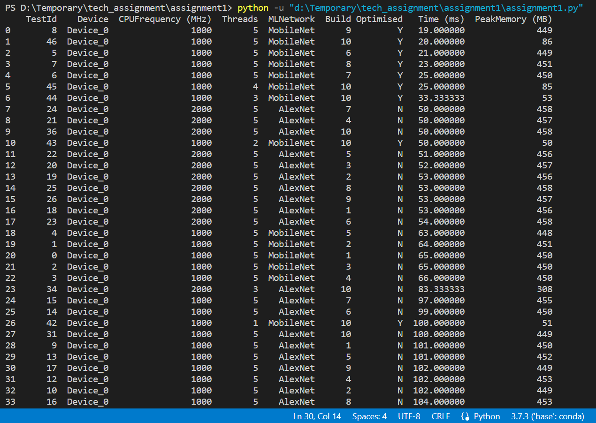
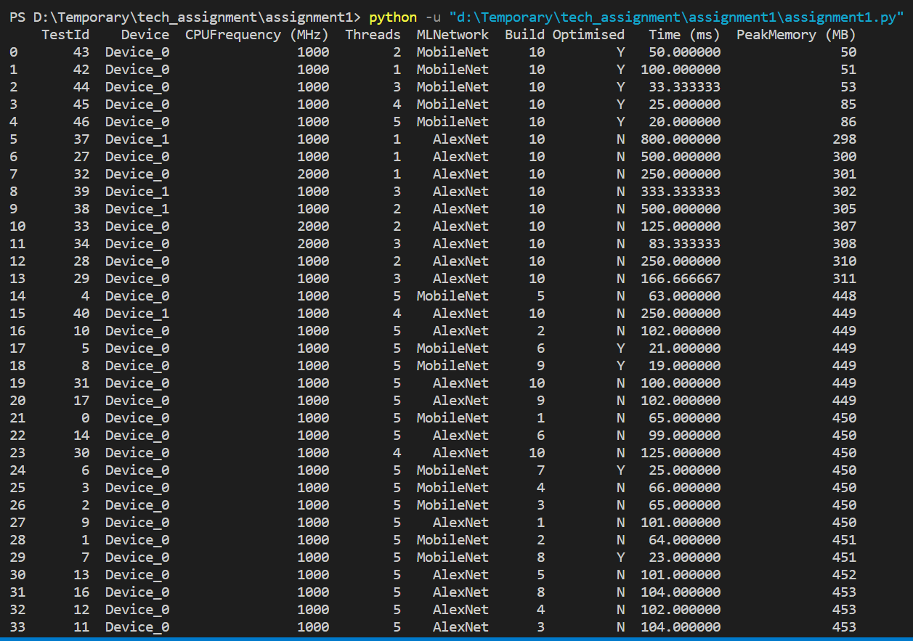

# Performance analysis of Machine Learning loads

#### Parameters

The parameters used for testing and analyzing the performance of Machine Learning(ML) devices.

```sh
Device              - Different Hardware(Device_0 and Device_1)
CPUFrequency(MHz)   - Frequency of the CPU, measured in Mega Hertz(2000 MHz and 1000 MHz)
Threads             - Number of Threads(1, 2, 3, 4, 5)
MLNetwork           - Network used(AlexNet, MobileNet)
Build               - Different Softwares(1, 2, 3, 4, 5, 6, 7, 8, 9, 10)
Optimized - Is Optimised? (Yes - Y, No - N)
Time(ms)            - Compute time/Speed(measured in milli seconds)
PeakMemory(MB)      - Memory used(measured in Mega Bytes)
```

The performance of Machine learning algorithms is mainly based on the Speed/Compute time(ms) and Memory used(PeakMemory). Firstly to analyze the performance data of the ML devices, the data is sorted based on parameters Time(ms) and PeakMemory(MB). The observations were as in the below figure.


##### Observation 1:

The observation is carried out based on the ML devices having the same configuration with different Hardware. This observation is done to analyze the performance of ML devices based on hardware (Device_0 and Device_1). From the above figure, the Test IDs of Device_0 and Device_1 and their respective Time and PeakMemory were tabulated below to compare them. The comparison is done by keeping parameters Build, CPUFrequency, Threads, and MLNetwork constant.

| Test IDs (Device_0, Device_1) | Build | CPU frequency(Mhz) | Threads | MLNetwork | Time(ms), PeakMemory(MHz) of Device_0 | Time(ms), PeakMemory(MHz) of Device_1 |
| ----------------------------- | ----- | ------------------ | ------- | --------- | ------------------------------------- | ------------------------------------- |
| 31, 41                        | 10    | 1000               | 5       | AlexNet   | 100.00, 449                           | 200.00, 454                           |
| 30, 40                        | 10    | 1000               | 5       | AlexNet   | 125.00, 450                           | 250.00, 449                           |
| 29, 39                        | 10    | 1000               | 5       | AlexNet   | 166.66, 311                           | 333.33, 302                           |
| 28, 38                        | 10    | 1000               | 5       | AlexNet   | 250.00, 310                           | 500.00, 305                           |
| 27, 37                        | 10    | 1000               | 5       | AlexNet   | 500.00, 300                           | 800.00, 298                           |

So, from the above table, we can conclude that Device_0 is performing well compared with Device_1.

##### Observation 2:

Here the performance analysis was mainly carried upon the factor Compute Time(ms) which is obtained from the test results. The results were sorted based on Device and Time(ms) as shown in the below figure. We can observe that Device_0 of Builds 6, 7, 8, 9, and 10 were performing well on Machine Learning loads. And all best-performing algorithms or devices are multithreaded(Threads = 5).



##### Observation 3:

This observation is carried out to find the best-performing devices based on the Memory used. The results were sorted based on the parameter PeakMemory as shown in the below figure.



So, by considering the parameter PeakMemory, Device_0 of build 10 having threads 1, 2, 3, 4, and 5 were performing well.

##### Observation 4:

Here, the importance of CPU frequency is observed. The tests and results include Device_0 configured at different CPU frequencies. The comparison was done on the CPU frequencies 1000 MHz and 2000 MHz of Device_0 to find the efficient one. The observation is tabulated below by choosing the devices Device_0 having similar parameters Build, Threads, and MLNetwork. The results were tabulated below, taken from the figure mentioned in Observation 3.

| Test IDs Device_0 | Build | Threads | MLNetwork | Time(ms), PeakMemory(MHz) of Device_0 when CPU frequency (2000 MHz) | Time(ms), PeakMemory(MHz) of Device_0 when CPU frequency (1000 MHz) |
| ----------------- | ----- | ------- | --------- | ------------------------------------------------------------------- | ------------------------------------------------------------------- |
| 36, 31            | 10    | 5       | AlexNet   | 50.00, 458                                                          | 100.00, 449                                                         |
| 35, 30            | 10    | 4       | AlexNet   | 300.00, 460                                                         | 125.00, 450                                                         |
| 34, 29            | 10    | 3       | AlexNet   | 83.33, 308                                                          | 166.66, 311                                                         |
| 33, 28            | 10    | 2       | AlexNet   | 125.00, 307                                                         | 250.00, 310                                                         |
| 32, 27            | 10    | 1       | AlexNet   | 250.00, 301                                                         | 500.00, 300                                                         |

So, from the above observations, Device_0 with a high CPU frequency i.e 2000 MHz is performing well compared to Device_0 with a CPU frequency of 1000 MHz. Another observation was that when the device is multithreaded(Threads 5 > 4 > 3 > 2) the memory used was more but Compute time was low. So, the number of threads is directly proportional to the PeakMemory and inversely proportional to Compute time.

##### Conclusions:

- The performance of device Device_0 is efficient when compared with Device_1.
- From Observations 2 and 3(by considering factors Compute time and Memory used), we can conclude that the best ML algorithm for loads is obtained with configuration,
  Hardware - Device_0
  Software - Build 10
  Threads - 2, 3, 4, 5 (Multithreaded)
  Network - MobileNet
- Multithreaded Devices will consume high memory(High PeakMemory) but have efficient Compute time.
- The ML devices having high CPU frequency perform well.

##### For developers:

Follow-up actions with the development team,

- Developing and optimizing the device Device_o algorithms using Network(AlexNet) and with more CPU frequency(2000 MHz) may help in obtaining better performance analysis.
- Developing multithreaded devices(Number of threads should be neither minimum nor maximum). The suggested number of threads is 3(as per the results we obtained).
